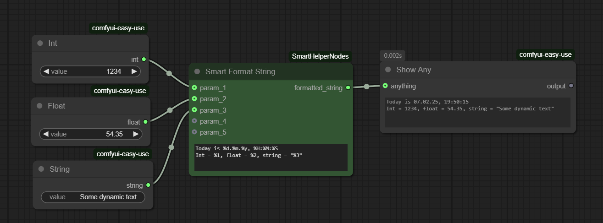
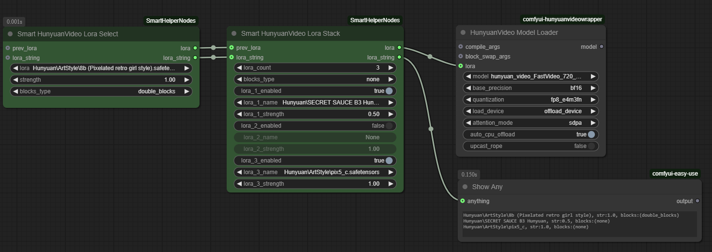

# ComfyUI Smart Helper Nodes

A collection of helper nodes for ComfyUI with smart functionality.

## Nodes

### Smart Format String, Smart Format String (10 params)
A node that formats a string with placeholders for input parameters and date/time.

### Smart HV LoRA Select, Smart HV LoRA Stack
Nodes for selecting and stacking HunyuanVideo LoRA files.
Also outputs a human-readable string of the LoRA file name and parameters (for example to save to a file).

## Installation

1. Clone this repository into your `ComfyUI/custom_nodes` directory: 